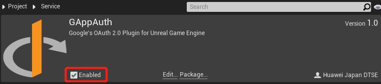
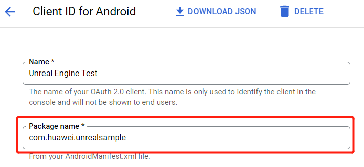
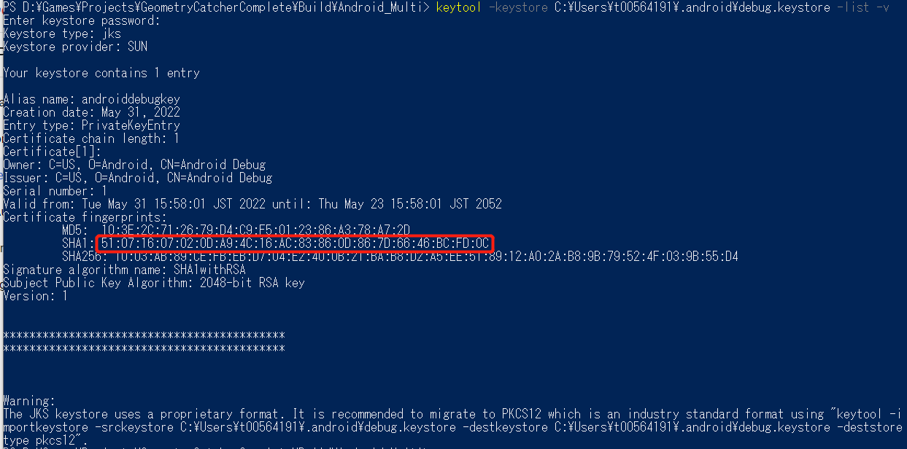
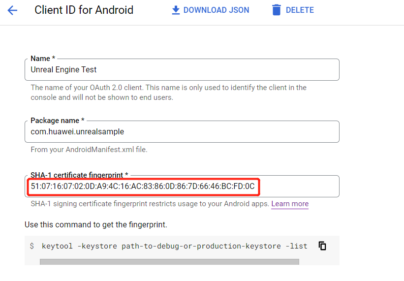
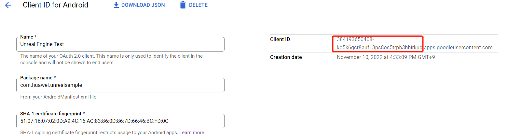
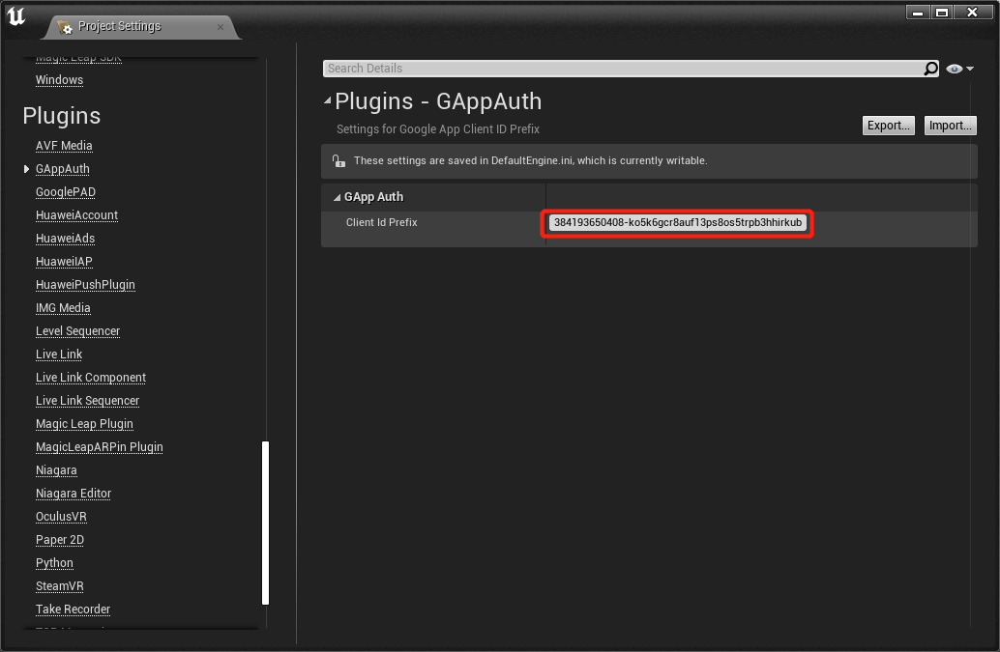
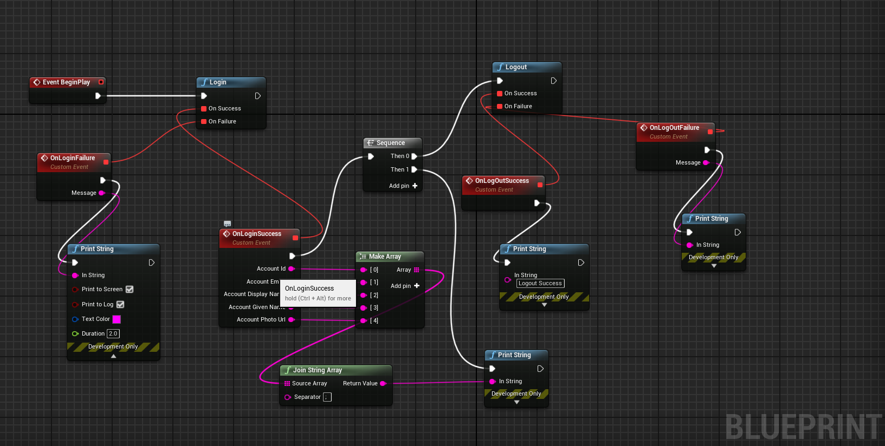

# Unreal_Engine_G_App_Auth_Plugin

## Introduction
Unreal Plugin for Google's OAuth 2.0 endpoints to authorize access to Google APIs.
Based on [GAppAuth Android library](https://github.com/billtom20/GAppAuth)

## Features
Support user to login by Google on Android devices that uses the Google's Oauth 2.0 endpoints
➞ can work well on devices that do not support Google Play Services

## Integrating into your Unreal Engine Project

### Create the OAuth2 client ID for Google Sign In
You can use the [quick-start configurator](https://goo.gl/pl2Fu2) or set up directly on the [Google Developer console](https://console.developers.google.com/apis/credentials?project=_) or refer to [this guide](https://developers.google.cn/identity/protocols/oauth2/native-app#prerequisites)

### Prepare for development
#### Install the plugin
Copy and enable the Unreal Engine Plugin.
If a `<unreal_project_directory>/Plugins` folder does not exist, create it.
From the GAppAuth Unreal plugin, copy the GAppAuth folder and its contents to `<unreal_project_directory>/Plugins`.

From your Unreal Editor, select **Edit ➞ Plugins** menu then enable the GAppAuth Plugin.


#### Set up the package name
Set the package name in **Edit ➞ Project Settings ➞ Android ➞ APK Packaging ➞ Android Package Name**
The package name needs to be same with your OAuth2.0 Client IDs 
You can also complete the rest of the settings here, such as version number, icons, resolution, etc. 



#### Set up the finger print
Use this below command to get the fingerprint information

```sh
keytool -keystore path-to-debug-or-production-keystore -list -v
```

Then copy the SHA1 value and paste it in the OAuth2.0 Client ID setting




#### Set up the Google client ID prefix
Access to the [Google Developer console](https://console.developers.google.com/apis/credentials?project=_), select your project then click on your OAuth2.0 Client ID then copy the prefix string before the `.apps.googleusercontent.com`
Next, open the **Unreal Engine Editor**, select **Edit ➞ Project Settings ➞ Plugins ➞ GAppAuth** then paste the prefix string in the above step into the **Client Id Prefix** text box




### Developing with the SDK
#### Using the Blueprint
The below functions are supported with Blueprint
- `login`
- `logout`
You can refer to the [Blueprint sample](Blueprint/GAppAuth.uasset).


#### Using C++ APIs
Access the GAppAuth APIs by including the header file `Account.h` in the related classes of your project.

```C++
#include "GAccount.h"
```

- Log in

```C++
gAppAuth::Account::login();
```
- Log out

Sample code
```C++
gAppAuth::Account::logout();
```

- Listen to callback events
Implement a listener class to receive information in all the Account callback events

Sample code
Header file
```C++
class YourAccountListener : public gAppAuth::AccountListener {
public:
    YourAccountListener();
    
    virtual void onLoginSuccess(const gAppAuth::GAccountInfo account) override;
    virtual void onLoginFailure(const FString message);
    virtual void onLogoutSuccess() override;
    virtual void onLogoutFailure(const FString message) override;
}
```

Then set it with the `setListener` API

Sample code
```C++
gAppAuth::Account::setListener(new YourAccountListener());
```

You can get the below account information
|<div style="width:80px">Type</div>                       | Description                | 
  | ------------------------------------------------------------ | ----------------------- |
  | id | user's id |
  | email | user's email address if user authorizes, otherwise **null** will be returned  |
  | displayName | user's displayName |
  | givenName | user's givenName |
  | photoUrl | user's profile photo url |
